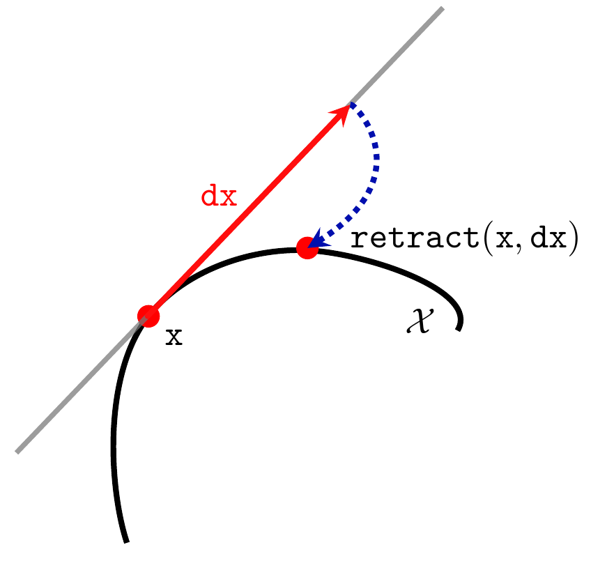

# Null Space Optimizer documentation

[[_TOC_]]

## Introduction

`nullspace_optimizer` is a package implementing the null space algorithm for nonlinear constrained
optimization. The whole algorithm is described in 

[1] Feppon F., Allaire G. and Dapogny C.
*Null space gradient flows for constrained optimization with applications to
 shape optimization.* 2019. ESAIM: COCV, 26 90 (Open Access). HAL preprint
 [hal-01972915](https://hal.archives-ouvertes.fr/hal-01972915/document).

This algorithm allows to solve arbitrary nonlinear constrained 
optimization problems of the form 


```math
\begin{aligned}
    \min_{x\in \mathcal{X}}&  \quad J(x)\\
    \textrm{s.t.} & \left\{\begin{aligned}
 g(x)&=0\\
 h(x)&\leqslant 0,
        \end{aligned}\right.
\end{aligned}
```

where $`\mathcal{X}`$ is the optimization set, $`J\,:\,\mathcal{X}\to \mathbb{R}`$ is the objective function,  
$`g\,:\,\mathcal{X}\rightarrow \mathbb{R}^p`$ and $`h\,:\,\mathcal{X}\rightarrow \mathbb{R}^q`$ are respectively the
 equality and inequality constraint functionals. The optimization set
$`\mathcal{X}`$ needs not to be finite-dimensional or even a vector space; it can be
rather arbitrary and needs only a sort of manifold structure respecting the
programming paradigms described below.

## Definition of an optimization problem

In the subsections below, we provide a short introduction to the main objects needed to solve an optimization problem with the nullspace optimizer. The reader is encouraged to look at the docstrings of the source code (e.g. of the routine [`nlspace_solve`](nullspace_optimizer/nullspace.py) or of the
 [`Optimizable`](nullspace_optimizer/optimizable.py) class) for more detailed information.

### The `nlspace_solve` routine

An optimization problem is defined by implementing an `Optimizable` object and solved by using the `nlspace_solve` function:

```python
from nullspace_optimizer import nlspace_solve

# Define problem

opt_results = nlspace_solve(problem: Optimizable, params=None, results=None)
```
The input variables are 
-  `problem` : an `Optimizable` object described below. This variable contains all the information about the optimization problem to solve (objective and constraint functions, derivatives...)
- `params`  : (optional) a dictionary containing algorithm parameters.

- `results` : (optional) a previous output of the `nlspace_solve` function. 
            The optimization will then keep going from the last input of
              the dictionary `results['x'][-1]`. This is useful when one needs to restart an optimization after an interruption.

The optimization routine `nlspace_solve` returns the dictionary `opt_results` which contains various information about the optimization path, including the values of the optimization variables `results['x']`.

### Definition of an `Optimizable` object

The argument `problem` of the `nlspace_solve` routine should be an object inheriting the abstract class `Optimizable`. An `Optimizable` object should define some of the following functions:
```python
from nullspace_optimizer import Optimizable

class MyOptimizable(Optimizable):
    # Initialization
    def x0(self):
        pass

    # Objective function
    def J(self, x):
        pass

    # Equality constraints
    def G(self, x):
        pass

    # Inequality constraints
    def H(self, x):
        pass
        return []

    # Fréchet derivative of the objective function
    def dJ(self, x):
        pass

    # Fréchet derivative of G
    def dG(self, x):
        pass

    # Fréchet derivative of H
    def dH(self, x):
        pass


    # Inner product metrizing the optimization set
    def inner_product(self, x):
        pass

    # Retraction 
    def retract(self, x, dx):
        pass

    # Post processing every time a new point on the optimization path is produced
    def accept(self, results):
        pass
```
The number of equality and inequality constraints is required to be defined by the user through
 the attributes `nconstraints` and `nineqconstraints`.
The functions `inner_product` and `retract` are useful to perform optimization on very general optimization sets. 
For solving standard optimization problems in $`\mathbb{R}^n`$, the user can make use
of the class `EuclideanOptimizable` which defines them automatically.

## Example: solving problems in the Euclidean space $`\mathbb{R}^n`$

Let us illustrate how to use the algorithm to solve the following simple optimization problem:
```math
\newcommand{\<}{\leq}
\begin{aligned} \min_{(x_0,x_1)\in\mathbb{R}^2} & \quad (x_0+1)^2+(x_1+1)^2 \\
s.t. &\quad  \left\{ \begin{aligned} x_0^2+x_1^2-1 & \< 0\\
                             x_0+x_1-1 & \< 0 \\
                             -x_1-0.7 & \<0.
                             \end{aligned}\right.
\end{aligned}
```

This problem is solved with the nullspace optimizer by the following code:

```python
from nullspace_optimizer import *


class problemeSimple(EuclideanOptimizable):
    def __init__(self, xinit):
        # n=2 is the dimension
        super().__init__(n=2)

        self.nconstraints = 0
        self.nineqconstraints = 3

    def x0(self):
        return [1.25,0]

    def J(self, x):
        return (x[0]+1)**2+(x[1]+1)**2

    def G(self, x):
        return []

    def H(self, x):
        return [x[0]**2+x[1]**2-1**2,
                x[0]+x[1]-1,
                -x[1]-0.7]

    def dJ(self, x):
        return [2*(x[0]+1), 2*(x[1]+1)]

    def dG(self, x):
        return []

    def dH(self, x):
        return [[2*x[0], 2*x[1]],
                [1, 1],
                [0, -1]]

# dt : the time step
# debug=5 for verbosity
params = {'dt': 0.01, 'debug': 1}
opt_results = nlspace_solve(problemSimple(), params)
```

This problem is solved and illustrated in `examples/ex1` where the optimization is run for several initializations. 
Running `python -m nullspace_optimizer.examples.ex1` should then produce the following figure:


## Using the nullspace optimizer on general optimization sets 

This section provides more details about the algorithm and how it can be used for more involved applications than parameteric optimization, 
such as in PDE related problems (e.g. topology optimization).

### Short summary of the principle of the algorithm and tuning of optimization parameters

The basis of the method is to solve an Ordinary Differential Equation (so-called ''null-space gradient flow''),
```math
    \dot{x}(t) =-\alpha_J \xi_J(x(t))-\alpha_C\xi_C(x(t)),
```
which is able to solve the optimization problem above.

The direction
$`\xi_J(x(t))`$ is called the null space direction, it is the ''best'' locally feasible
descent direction for minimizing $`J`$ while locally respecting the constraints. 
The direction
$`\xi_C(x(t))`$ is called the range space direction, it makes the violated constraints
better satisfied and corrects unfeasible initializations. Optimization trajectories
always follow the best possible direction. The delicate part of
the method is to detect when to unstick a saturated constraint and to come back into
the interior of the feasible domain. Such is achieved thanks to the resolution of a
dual quadratic subproblem described in [1]. In the present implementation, this subproblem is solved by default with the open source 
library [cvxopt](https://cvxopt.org/) (but it can be changed to [osqp](https://osqp.org/) by setting 
`params['qp_solver']='osqp'` in the parameters passed to the `nlspace_solve` routine).

The parameter $`\alpha_J>0`$ tunes the rate at which the objective function values
decrease while not worsening the constraints.  The parameter $`\alpha_C>0`$ tunes the pace
at which the violation of the constraints decrease (it decreases along the continuous trajectory at a rate $`e^{-\alpha_C t}`$).
In principle, the success of the null-space gradient flow in finding local minimizers 
does not depend of the choice of these parameters, however setting them manually to custom values may sometimes help (e.g. if satisfying a constraint too quickly prevents to find good minimizers).
$`\alpha_J`$ and $`\alpha_C`$ can be be manually
affected by the user by setting `params['alphaJ']` and `params['alphaC']` to desired values
 treated as dimensionless coefficients (a value between 0.01 and 2 is
generally sufficient). It must then be understood that the optimizer will apply an
automatic rescaling to ensure that:
- the discretized null space step $`-\alpha_J \xi_J(x(t))\Delta t`$ has a length not larger than
  `params['alphaJ']*params['dt']`. The null space step is exactly of this length for
  the first `params['itnormalisation']` iterations (set by default to 1).
- the discretized range space step $`-\alpha_C \xi_C(x(t))\Delta t`$ of length not larger
  `params['alphaC']*params['dt']` for decreasing the violation of the constraints.

The actual values of $`\alpha_J`$ and $`\alpha_C`$ is automatically set by the
routines to make the above length requirement satisfied. A custom value of
$`\alpha_C`$ can be set for each constraint by setting this parameter to 1 and
assigning a value to `params['alphas']` instead.

### Optimization on general optimization sets 

The interface of the `nlspace_solve` function is designed to allow for optimization on
general sets respecting some manifold structure. One of the initial motivations of
this code was indeed to be used for topology optimization with the level set method
as illustrated in [1]. 

The programming paradigm corresponds to the ingredients illustrated on the following
figure:





In order to solve an arbitrary optimization problem, it is sufficient that 
the following information be provided (as object methods)
by the supplied instance `problem` of an
`Optimizable` object: 
- `J` $`:\mathcal{X}\to\mathbb{R}`$, `G` $`:\mathcal{X}\to\mathbb{R}^p`$, `H` $`:\mathcal{X}\to\mathbb{R}^q`$
        objective functions, $`p`$ equality constraints and $`q`$ inequality constraints;
- `DJ` $`:\mathcal{X}\to\mathbb{R}^n`$, `DG` $`:\mathcal{X}\to\mathbb{R}^{p\times n}`$, `DH`$`\, : \,\Chi \to \R^{q\times n}`$: Fréchet derivatives of objective and
        constraints as functions.
Here,         $`n`$ is thought of as the dimension of the
        tangent space of $`\mathcal{X}`$ to `x` $`\in\mathcal{X}`$ (it does not need to remain constant along iterations). For such a given $`x`$, 
        `DJ(x)`$`^{T}`$`dx` is
 the variation of the objective function `J` at `x` along the tangent
 direction  `dx` $`\in \mathbb{R}^{n}`$;
- `inner_product` $`:\,\Chi\to \mathbb{R}^{n\times n}`$: local inner product needed for
        the computation of gradients. If $`A=`$ `inner_product(x)`, then  the gradients are given by
        $`\nabla`$`J(x)`$`:=A^{-1}`$`DJ(x)`, $`\nabla`$`g_i(x)`$`:=A^{-1}`$`Dg_i(x)`, 
        $`\nabla`$`h_j(x)`$`:=A^{-1}`$`Dh_j(x)`$`\in\R^{n}`$.
        Of course, $`A`$ must be a symmetric positive
        definite matrix.
- `retract` $`:\,\Chi\times \R^{n}\to \Chi`$: a *retraction* that
        converts the current point `x` and a tangent vector `dx`$`\in \R^{n}`$ into
        a new point  `retract(x,dx)`$`\in \Chi`$ on the manifold $`\Chi`$.
        This mapping must be compatible with the previous definitions of the derivatives
        `DJ`, `Dg_i` and `Dh_j` in the following sense:
           `J(retract(x,h*dx))=J(x)+ h * DJ(x)^{T}dx +o(h)` as `h`$`\rightarrow 0`$.
- `accept`: an optional function that is called by the optimization
        algorithm when the next point `x`$`\in\Chi`$ is accepted, which serves
        e.g. for saving current available information before proceeding to the next
        iteration.

The above ingredients constitute all the necessary information required by 
the null space algorithm and to be implemented according to the `Optimizable` interface.

Note that the variable $`x`$ 
does not need to be a vector (it can be 
for instance the  path to a file...), while $`dx`$ needs to be one.
 This programming paradigm allows to use the null space algorithm 
on a variety of applications. For instance, it was also used for 3D topology optimization
with various constraints in 

[2] Feppon, F., Allaire, G., Dapogny D. and Jolivet, P. *Topology optimization of
thermal fluid-structure systems using body-fitted meshes and parallel computing*
(2020). Journal of Computational Physics, 109574. HAL preprint [hal-02518207](https://hal.archives-ouvertes.fr/hal-02518207/document). 
