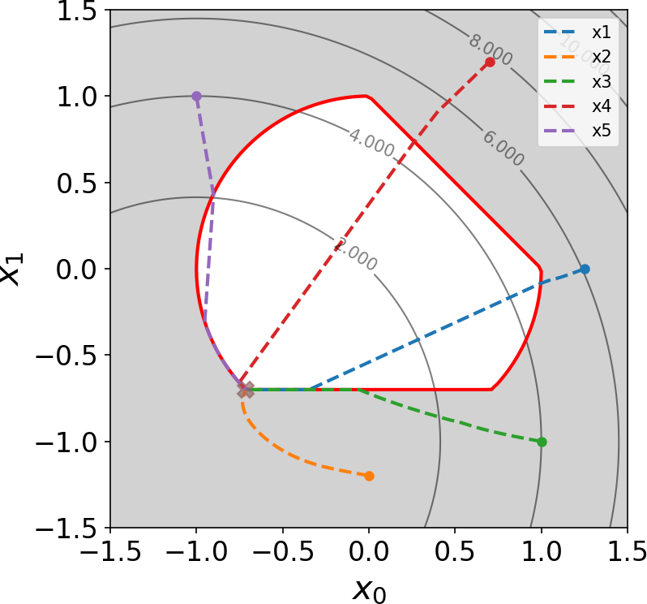

.. pyfreefem documentation master file, created by
   sphinx-quickstart on Sun Apr 23 20:02:20 2023.
   You can adapt this file completely to your liking, but it should at least
   contain the root `toctree` directive.
    

.. toctree::
   :maxdepth: 0
   :hidden:
   :caption: Documentation
    
   installation
   quickstart
   examples
   citation
   licence
      
.. toctree::    
   :maxdepth: 0 
   :hidden: 
   :caption: Features
    
   features/bound_constraints
   features/filtered
   features/minmax  
   features/equalized   
   features/memoization
   features/optimizers
   features/symbolic

   
.. toctree::    
   :maxdepth: 0 
   :hidden: 
   :caption: API
      
   api/optimizable
   api/euclidean_optimizable    
   api/nlspace_solve
   api/bound_constraints_optimizable
   api/filtered
   api/minmax
   api/equalized_optimizable
   api/symbolic_optimizable
   api/memoize

Null Space Optimizer
====================

``nullspace_optimizer`` is a Python package implementing the null space
algorithm for nonlinear constrained optimization. It has been developped in the
context of topology optimization  problems with the level-set and the density
method, but it can in principle be used for solving arbitrary smooth nonlinear
equality and inequality constrained optimization problems of the form   
    
.. math::
   :label: eq_opt

   \begin{aligned}
       \min_{x\in \mathcal{X}}&  \quad J(x)\\
       \textrm{s.t.} & \left\{\begin{aligned}
    g_i(x)&=0, \text{ for all } 1\leqslant i\leqslant p,\\
    h_j(x)  &\leqslant  0, \text{ for all }1\leqslant j \leqslant q,\\ 
           \end{aligned}\right.
   \end{aligned}
    
    

   Optimization trajectories produced by the Null Space Optimizer   
   for an inequality constrained optimization problem     
   with different initialization.
    

Contribute and support
----------------------
    
* Issue tracker: https://gitlab.com/florian.feppon/null-space-optimizer/-/issues
* Source code: https://gitlab.com/florian.feppon/null-space-optimizer
    
If I am not responding on the issue tracker, feel free to send me an email to   
florian.feppon[at]kuleuven.be
    
Citation
--------
    
Please cite either of the following references when using this source:

.. pull-quote:: 

    Feppon F., Allaire G. and Dapogny C. *Null space gradient flows for
    constrained optimization with applications to shape optimization.* 2020.
    ESAIM: COCV, 26 90
    `doi:10.1051/cocv/2020015 <https://doi.org/10.1051/cocv/2020015>`_
        
.. pull-quote::

   Feppon F. *Density based topology optimization with the Null Space Optimizer: a
   tutorial and a comparison* (2024).   
   `Structural and Multidisciplinary Optimization, 67(4), 1-34. <https://link.springer.com/article/10.1007/s00158-023-03710-w>`_. 

.. code-block:: bibtex

    @article{feppon2020optim,
       author = {{Feppon, F.} and {Allaire, G.} and {Dapogny, C.}},
       doi = {10.1051/cocv/2020015},
       journal = {ESAIM: COCV},
       pages = {90},
       title = {Null space gradient flows for constrained optimization with applications to shape optimization},
       url = {https://doi.org/10.1051/cocv/2020015},
       volume = 26,
       year = 2020
    }

        
.. code-block:: bibtex  
   
   @article{Feppon2024density,
      title     = "Density-based topology optimization with the Null Space Optimizer: a tutorial and a comparison",
      author    = "Feppon, Florian",
      journal   = "Structural and Multidisciplinary Optimization",
      publisher = "Springer",
      volume    =  67,
      number    =  1,
      pages     = "1--34",
      month     =  jan,
      year      =  2024
   }

Licence 
-------
    
The Null Space Optimizer is a free software distributed under the terms of     
the GNU General Public Licence `GPL3 <https://www.gnu.org/licenses/gpl-3.0.html>`_.
