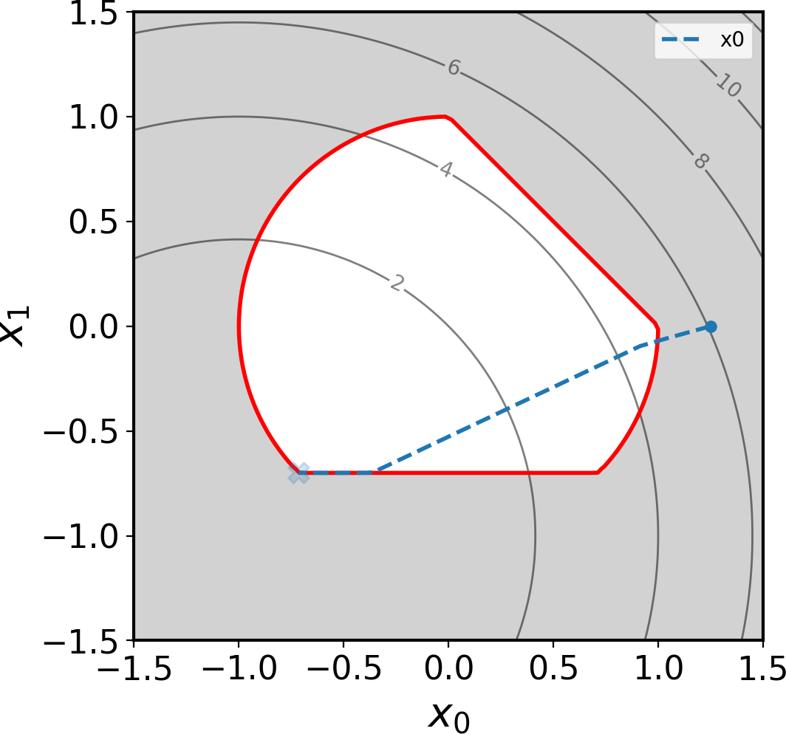

Quick start
===========

The Null Space Optimizer is an algorithm 
that  solves arbitrary nonlinear constrained
optimization problems of the form

.. math::

   \begin{aligned}
       \min_{x\in \mathcal{X}}&  \quad J(x)\\
       \textrm{s.t.} & \left\{\begin{aligned}
    g_i(x)&=0, \text{ for all } 1\leqslant i\leqslant p,\\
    h_j(x)  &\leqslant  0, \text{ for all }1\leqslant j \leqslant q,\\ 
           \end{aligned}\right.
   \end{aligned}

where :math:`\mathcal{X}` is the optimization set,
:math:`J\,:\,\mathcal{X}\to \mathbb{R}` is the objective function,
:math:`g\,:\,\mathcal{X}\rightarrow \mathbb{R}^p` and
:math:`h\,:\,\mathcal{X}\rightarrow \mathbb{R}^q` are respectively
the equality and inequality constraint functionals. The optimization
set :math:`\mathcal{X}` may be, but is not restricted to finite-dimensional or even a
vector space; it can be rather arbitrary and needs only a sort of
manifold structure .

The whole algorithm is
described in

   _`[1]` Feppon F., Allaire G. and Dapogny C. *Null space gradient flows for
   constrained optimization with applications to shape optimization.* 2019.
   ESAIM: COCV, 26 90 (Open Access). HAL preprint
   `hal-01972915 <https://hal.archives-ouvertes.fr/hal-01972915/document>`__    
    
and its extension to for dealing with many constraints with sparse Jacobian matrix is
explained in
    
   _`[2]` Feppon F. *Density based topology optimization with the Null Space Optimizer: a
   tutorial and a comparison* (2023).   
   Submitted. HAL preprint `hal-04155507 <https://hal.archives-ouvertes.fr/hal-04155507/document>`_. 

.. _solving_standard_pb: 

Solving standard optimization problems  
--------------------------------------

In many "standard" optimization problems, the design variable belong to a finite-dimensional space    
:math:`\mathbb{R}^n` where :math:`n` is a fixed integer.    

Let us illustrate how to use the Null Space Optimizer to solve the following simple
optimization problem based on `basic_examples/ex05_multiple_shootings.py <https://gitlab.com/florian.feppon/null-space-optimizer/-/blob/public-master/nullspace_optimizer/examples/basic_examples/ex05_multiple_shootings.py>`_:

.. math::

   \newcommand{\<}{\leq}
   \begin{aligned} \min_{(x_0,x_1)\in\mathbb{R}^2} & \quad (x_0+1)^2+(x_1+1)^2 \\
   s.t. &\quad  \left\{ \begin{aligned} x_0^2+x_1^2-1 & \< 0\\
                                x_0+x_1-1 & \< 0 \\
                                -x_1-0.7 & \<0.
                                \end{aligned}\right.
   \end{aligned}

This problem can be implemented by      
instantiating an :py:class:`~nullspace_optimizer.EuclideanOptimizable` object:  

.. code:: python

   from nullspace_optimizer import EuclideanOptimizable

   class problemSimple(EuclideanOptimizable):
       # Initialization
       def x0(self):
           return [1.25,0]

       # Objective function
       def J(self, x):
           return (x[0]+1)**2+(x[1]+1)**2

       # Inequality constraint
       def H(self, x):
           return [x[0]**2+x[1]**2-1**2,
                   x[0]+x[1]-1,
                   -x[1]-0.7]

       # Row vector with the gradient of J
       def dJ(self, x):
           return [2*(x[0]+1), 2*(x[1]+1)]

       # Jacobian matrix of H
       def dH(self, x):
           return [[2*x[0], 2*x[1]],
                   [1, 1],
                   [0, -1]]

                    
Actually, for this simple problem, the gradient and Jacobian matrix can be computed automatically with  
:ref:`symbolic differentiation <symbolic_differentiation>`.

The problem can then be solved numerically with the  :py:func:`~nullspace_optimizer.nlspace_solve` function.        

            
.. code:: python    

   from nullspace_optimizer import nlspace_solve

   # dt : the time step
   # debug=1 for verbosity
   params = {'dt': 0.1}
   opt_results = nlspace_solve(problemSimple(), params)
    
The time step ``params['dt']=0.01``  
delimits the maximal update size. Running the following code yields the following output:   
    
.. code:: console   
    
   0. J=6.0625 G=[] H=[0.5625,0.25,-0.7]
   1. J=5.09448 G=[] H=[0.1056,-0.005556,-0.6444]
   2. J=4.48126 G=[] H=[-0.156,-0.1814,-0.6049]
   3. J=4.09178 G=[] H=[-0.2949,-0.3067,-0.5646]
   4. J=3.73614 G=[] H=[-0.4111,-0.4264,-0.5262]
   5. J=3.41142 G=[] H=[-0.5071,-0.5407,-0.4895]
   6. J=3.11492 G=[] H=[-0.585,-0.65,-0.4544]
   7. J=2.84419 G=[] H=[-0.6468,-0.7545,-0.4209]
   8. J=2.597 G=[] H=[-0.6944,-0.8543,-0.3888]
   9. J=2.37128 G=[] H=[-0.7294,-0.9496,-0.3582]
   10. J=2.16518 G=[] H=[-0.7533,-1.041,-0.329]
   11. J=1.977 G=[] H=[-0.7673,-1.128,-0.301]
   12. J=1.80517 G=[] H=[-0.7727,-1.211,-0.2743]
   13. J=1.64828 G=[] H=[-0.7706,-1.291,-0.2488]
   14. J=1.50502 G=[] H=[-0.7619,-1.367,-0.2244]
   15. J=1.37421 G=[] H=[-0.7475,-1.439,-0.2011]
   16. J=1.25478 G=[] H=[-0.7282,-1.509,-0.1788]
   17. J=1.14572 G=[] H=[-0.7047,-1.575,-0.1575]
   18. J=1.04614 G=[] H=[-0.6776,-1.638,-0.1372]
   19. J=0.955217 G=[] H=[-0.6474,-1.699,-0.1178]
   20. J=0.872196 G=[] H=[-0.6148,-1.757,-0.0992]
   21. J=0.79639 G=[] H=[-0.5801,-1.812,-0.08145]
   22. J=0.727173 G=[] H=[-0.5437,-1.865,-0.0645]
   23. J=0.663972 G=[] H=[-0.5059,-1.915,-0.0483]
   24. J=0.606263 G=[] H=[-0.4672,-1.963,-0.03282]
   25. J=0.553571 G=[] H=[-0.4277,-2.009,-0.01803]
   26. J=0.505458 G=[] H=[-0.3878,-2.053,-0.003894]
   27. J=0.467436 G=[] H=[-0.3617,-2.085,-0.0003894]
   28. J=0.434441 G=[] H=[-0.3394,-2.113,-3.894e-05]
   29. J=0.404486 G=[] H=[-0.3171,-2.139,-3.894e-06]
   30. J=0.377151 G=[] H=[-0.2946,-2.164,-3.894e-07]
   31. J=0.352193 G=[] H=[-0.2719,-2.188,-3.894e-08]
   32. J=0.329405 G=[] H=[-0.2492,-2.211,-3.894e-09]
   33. J=0.308597 G=[] H=[-0.2265,-2.232,-3.894e-10]
   34. J=0.289598 G=[] H=[-0.2039,-2.253,-3.894e-11]
   35. J=0.272251 G=[] H=[-0.1816,-2.273,-3.894e-12]
   36. J=0.256411 G=[] H=[-0.1595,-2.292,-3.895e-13]
   37. J=0.241947 G=[] H=[-0.1377,-2.31,-3.897e-14]
   38. J=0.228741 G=[] H=[-0.1162,-2.328,-3.886e-15]
   39. J=0.216682 G=[] H=[-0.09517,-2.344,-4.441e-16]
   40. J=0.205672 G=[] H=[-0.07454,-2.36,0]
   41. J=0.195619 G=[] H=[-0.05436,-2.375,0]
   42. J=0.186439 G=[] H=[-0.03465,-2.389,0]
   43. J=0.178057 G=[] H=[-0.01543,-2.403,0]
   44. J=0.172294 G=[] H=[-0.001446,-2.413,0]
   45. J=0.171772 G=[] H=[-0.0001437,-2.414,0]
   46. J=0.17172 G=[] H=[-1.436e-05,-2.414,0]
   47. J=0.171715 G=[] H=[-1.436e-06,-2.414,0]

   Optimization completed.
   48. J=0.171714 G=[] H=[-1.436e-07,-2.414,0]

For this simple optimization problem with two variables, it is possible to draw the             
optimization trajectory with    
    
.. code:: python    
    
   import nullspace_optimizer.examples.basic_examples.utils.draw as draw

   draw.drawProblem(problemSimple(), [-1.5, 1.5], [-1.5, 1.5])
   draw.drawData(opt_results, f'x0', f'C0', x0=True, xfinal=True, initlabel=None)
   draw.show()

which should produce the following figure:    
        

    
   Optimization trajectory produced by the Null Space Optimizer     
   starting from the point (1.25,0).    

.. _manifold_structure:

Using the Null Space Optimizer on general optimization sets
------------------------------------------------------------

It is possible to use the Null Space Optimizer for  for more involved
applications than parametric optimization working on Euclidean spaces    as
described :ref:`above <solving_standard_pb>`.  One of
the initial motivations for the development of the Null Space Optimizer 
was to be used for topology
optimization with the level set method (see `[1]`_).

The :py:func:`~nullspace_optimizer.nlspace_solve` function is designed to   
perform optimization on general sets respecting some manifold structure.    
These sets must comply with the structure of the :py:class:`~nullspace_optimizer.Optimizable` class 
that requires a minimum number of methods to be defined,
that contain all the necessary information about the
optimization problem to solve (objective and constraint functions,
derivatives...).  

An :py:class:`~nullspace_optimizer.Optimizable`
object should implement the following structure:

.. code:: python

   from nullspace_optimizer import Optimizable

   class MyOptimizable(Optimizable):
       # Initialization
       def x0(self):
           pass

       # Objective function
       def J(self, x):
           pass

       # Equality constraints
       def G(self, x):
           pass

       # Inequality constraints
       def H(self, x):
           pass

       # Derivative of the objective function
       def dJ(self, x):
           pass

       # Jacobian matrix of G
       def dG(self, x):
           pass

       # Jacobian matrix of H
       def dH(self, x):
           pass

       # Inner product metrizing the optimization set
       def inner_product(self, x):
           pass

       # Retraction 
       def retract(self, x, dx):
           pass

       # Post processing every time a   
       # point on the optimization path is accepted
       def accept(self, params, results):
           pass

The methods ``inner_product`` and ``retract``
are useful to perform optimization on very general optimization sets.
When solving standard optimization problems in :math:`\mathbb{R}^n`,
with the subclass :py:class:`~nullspace_optimizer.EuclideanOptimizable`, these methods are
defined automatically. If the optimization problem features no equality constraint (respectively, no inequality constraint),    
the methods ``G`` and ``dG`` (respectively ``H`` and ``dH``) do not need to be defined.
    

These methods must satisfy the following requirements:  

-  :math:`\texttt{J}:\mathcal{X}\to\mathbb{R}`, :math:`\texttt{G}:\mathcal{X}\to\mathbb{R}^p`,    
   :math:`\texttt{H}:\mathcal{X}\to\mathbb{R}^q` objective function, :math:`p`
   equality constraints and :math:`q` inequality constraints; 

- :math:`\texttt{retract}:\mathcal{X}\times \R^{n}\to \mathcal{X}`: a *retraction* that
  converts the current point ``x`` and a tangent vector
  ``dx``\ :math:`\in \R^{n}` into a new point
  :math:`\texttt{retract(x,dx)}\in \mathcal{X}` on the manifold :math:`\mathcal{X}`.  
  The  :py:class:`~nullspace_optimizer.Optimizable`
  object is conceptually understood as a curved set where one can move from one point to another in a   
  direction from the tangent space. The retraction is a map that allows to do this update.  
  Here, :math:`n` is thought of
  as the dimension of the tangent space of :math:`\mathcal{X}` to 
  :math:`\texttt{x}\in\mathcal{X}`. This tangent space  does not need to remain constant along
  iterations.   
  An illustration of this concept is given in the following figure:     
    
  .. figure:: img/manifold.png  
     :height: 300px     
     :align: center
    
     Schematic of the ``retract`` map which allows to perform design    
     updates given the current point ``x`` and the descent direction ``dx``. 

- :math:`\texttt{DJ}:\mathcal{X}\to\mathbb{R}^n`, 
  :math:`\texttt{DG}:\mathcal{X}\to\mathbb{R}^{p\times n}`,
  :math:`\texttt{DH} :\Chi \to \R^{q\times n}`: (Fréchet) derivatives of
  objective and constraints as functions.   
  This means that the following asymptotic expansion must hold:     

  .. math::

     \texttt{J}(\texttt{retract}(\texttt{x},h\times\texttt{dx}))=\texttt{J}(\texttt{x})+     
     h \times \texttt{DJ}(\texttt{x})^{T}\texttt{dx} +o(h) \text{ as }
     h\rightarrow 0, 
    
  and similarly for :math:`\texttt{DG}` and :math:`\texttt{DH}`.  
  In other words, 
  :math:`\texttt{DJ}^{T}\texttt{dx}` is the variation of the objective
  function :math:`\texttt{J}` at :math:`\texttt{x}` along the tangent direction :math:`\texttt{dx}\in \mathbb{R}^{n}`.  

- :math:`\texttt{inner\_product}:\,\mathcal{X}\to \mathbb{R}^{n\times n}`: the   
  local inner product needed
  for the computation of gradients, given in the form of a sparse scipy matrix in   
  the `csc <https://docs.scipy.org/doc/scipy/reference/generated/scipy.sparse.csc_matrix.html>`_ format.    
  If :math:`A=\texttt{inner\_product}(\texttt{x})`,
  then the gradients at :math:`\texttt{x}` are given by
  :math:`\nabla \texttt{J}(\texttt{x})=A^{-1}\texttt{DJ(x)}`,
  :math:`\nabla \texttt{g}_i(\texttt{x}):=A^{-1}\texttt{Dg}_i(\texttt{x})`,
  :math:`\nabla\texttt{h}_j(\texttt{x}):=A^{-1}\texttt{Dh}_j(\texttt{x})`.
  Of course, :math:`A` must be a symmetric positive definite matrix.    
    

- ``accept``: an optional function that
  is called by the optimization algorithm when the next point
  is accepted, which serves e.g. for saving
  current available information before proceeding to the next iteration. This method    
  has access to the ``results`` dictionary that contains the output of the optimization as  
  well as the dictionary ``params``. These dictionary can be manually updated in the course of the  
  optimization if the user wants to implement gradation schemes. 

.. note::   
    
   The variable ``x`` from the implementation 
   does not need at all to be a vector: it can
   be for instance the path to a file. Only ``dx`` needs to be
   a vector (a `numpy array <https://numpy.org/doc/stable/reference/generated/numpy.array.html>`_). 
   This programming paradigm allows to use the Null Space Optimizer     
   on
   a variety of applications. For instance, it was used for 3D
   topology optimization with various constraints in

   [3] Feppon, F., Allaire, G., Dapogny D. and Jolivet, P. *Topology
   optimization of thermal fluid-structure systems using body-fitted meshes
   and parallel computing* (2020). Journal of Computational Physics,
   109574. HAL preprint
   `hal-02518207 <https://hal.archives-ouvertes.fr/hal-02518207/document>`__.

Running the Null Space Optimizer
--------------------------------

    
    
The :py:func:`~nullspace_optimizer.nlspace_solve` function can run on any 
:py:class:`~nullspace_optimizer.Optimizable` that respects the structure described above.   
The prototype of this function reads:

.. code:: python

   from nullspace_optimizer import nlspace_solve

   # Define problem

   opt_results = nlspace_solve(problem: Optimizable, params=None, results=None)

The input variables are     
    
- ``problem`` : an :py:class:`~nullspace_optimizer.Optimizable` object
  implementing the structure described :ref:`above <manifold_structure>`.   
  For standard optimization problems sets on     
  Euclidean spaces, it is sufficient to instantiate the subclass :py:class:`~nullspace_optimizer.EuclideanOptimizable`.
    
- ``params`` : (optional) a dictionary containing
  algorithm parameters. 

-  ``results`` : (optional) a previous output of the :py:func:`~nullspace_optimizer.nlspace_solve`
   function. If supplied, the optimization will keep going from the last input
   of the dictionary ``results['x'][-1]``. This is useful when one needs
   to restart an optimization after an interruption.

The optimization routine  :py:func:`~nullspace_optimizer.nlspace_solve` returns the dictionary
``opt_results`` which contains various information about the
optimization path.  The optimized variable is accessible via 
``results['x'][-1]``.

Basic principles of the algorithm
---------------------------------

The basis of the method is to solve an Ordinary Differential Equation
(so-called ‘’null-space gradient flow’’),

.. math::
   :label: nlspace_ode_2

    \dot{x}(t) =-\alpha_J \xi_J(x(t))-\alpha_C\xi_C(x(t)),

which is able to solve the optimization problem above.

The direction :math:`\xi_J(x(t))` is called the **null space direction**,
it is the ‘’best’’ (in an :math:`L^2` sense) locally feasible descent direction for minimizing
:math:`J` while locally respecting the constraints. The direction
:math:`\xi_C(x(t))` is called the range space direction, it makes the
violated constraints better satisfied and corrects unfeasible
initializations. Optimization trajectories produced by  :eq:`nlspace_ode_2`
always follow the best
possible direction.     
    
The delicate part of the method is to detect when the optimization path should 
unstick a saturated constraint and come back into the interior of the
feasible domain. Such is achieved thanks to the resolution of a dual
quadratic subproblem described in `[1]`_. In the present implementation,
this subproblem is solved by default with the open source library
`osqp <https://osqp.org/>`_
(but it can be changed to `cvxopt <https://cvxopt.org/>`_
by setting ``params['qp_solver']='cvxopt'``
in the parameters passed to the  :py:func:`~nullspace_optimizer.nlspace_solve` routine).

The parameter :math:`\alpha_J>0` tunes the rate at which the objective
function values decrease while not worsening the constraints. The
parameter :math:`\alpha_C>0` tunes the pace at which the violation of
the constraints decrease (it decreases along the continuous trajectory
at a rate :math:`e^{-\alpha_C t}`). In principle, the success of the
null-space gradient flow in finding local minimizers does not depend of
the choice of these parameters, however setting them manually to custom
values may sometimes help (e.g. if satisfying a constraint too quickly
prevents to find good minimizers). :math:`\alpha_J` and
:math:`\alpha_C` can be be manually affected by the user by setting
``params['alphaJ']`` and ``params['alphaC']`` to desired values treated
as dimensionless coefficients (a value between 0.01 and 2 is generally
sufficient).    
    
It must be understood that the optimizer will apply an
automatic rescaling to ensure that:     
    
- the absolute value of the components of the null space step
  :math:`-\alpha_J \xi_J(x(t))\Delta t` do not exceed   
  ``params['alphaJ']*params['dt']``. The null space step is exactly of
  this length for the first ``params['itnormalisation']`` iterations (set
  by default to 1).     
        
- the absolute value of the components of the range space step
  :math:`-\alpha_C \xi_C(x(t))\Delta t` do not exceed  
  ``params['alphaC']*params['dt']``.    

The actual values of :math:`\alpha_J` and :math:`\alpha_C` is
automatically set by the routines to make the above length requirement
satisfied. A custom value of :math:`\alpha_C` can be set for each
constraint by setting this parameter to 1 and assigning a value to
``params['alphas']`` instead.

    
