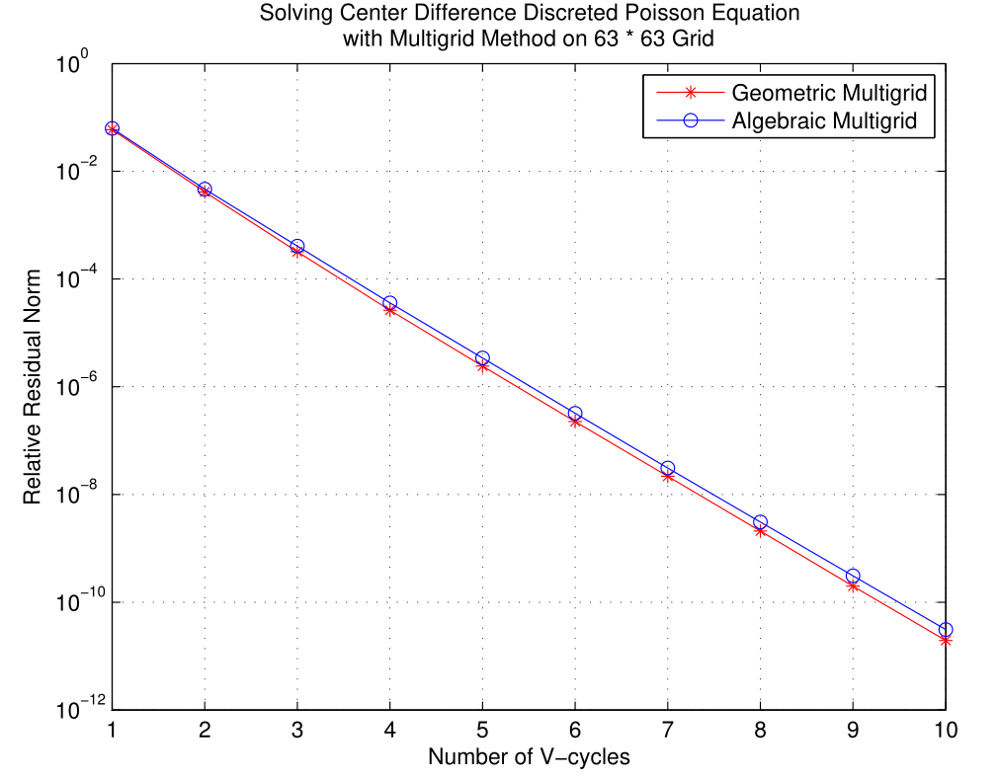
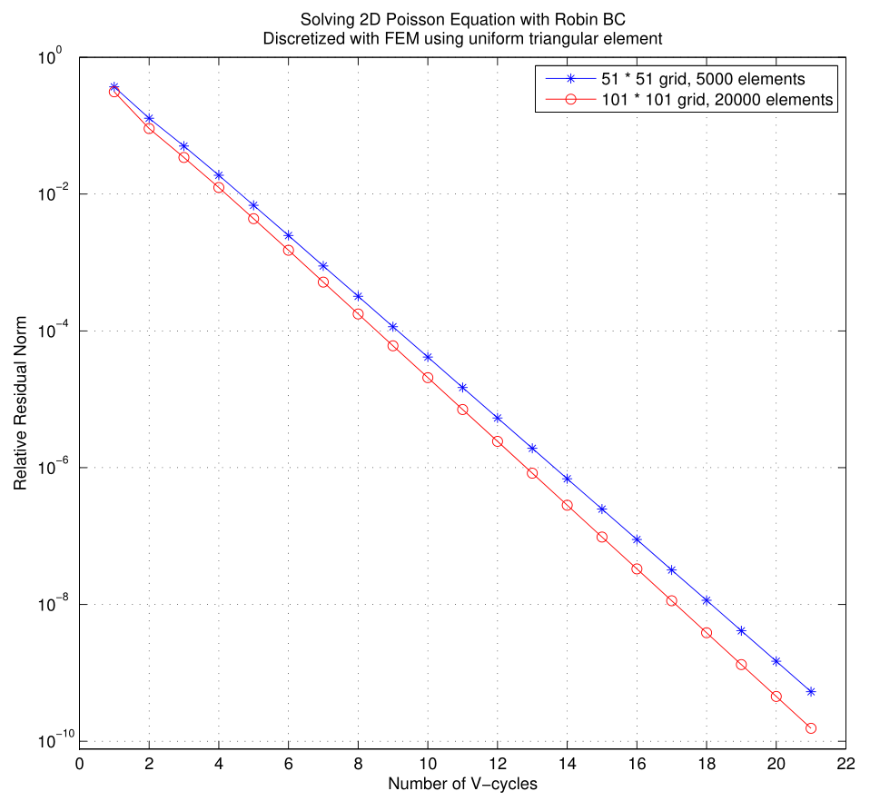

# Classic Algebraic Multigrid Method (AMG) Demo

Naïve implementation of the Classic Algebraic Multigrid Method (AMG). The major procedure of the multigrid solver and the parameters in the solver (like the number of pre- and post-smoother) is almost the same as [my previous GMG repo](https://github.com/EnigmaHuang/Poisson_FDM_Multigrid). Source codes are clean and should be easy to read. Generating coarse grid problem may be a little slow :)

**Notice: The ''Second pass'' in generating coarse grid in Classic AMG is not included in my code.** 

Here is a small comparison of Geometric Multigrid (GMG) and Algebraic Multigrid (AMG): 

Here is another test case: solving the linear system generated by FEM using uniform triangular element (using MATLAB code in [this repo](https://github.com/EnigmaHuang/Poisson2D_FEM) to generate data):

Reference:

1.  Yousef Saad, *Iterative Methods for Sparse Linear System (Second Edition)*, Philadelphia: SIAM, 2003 [Online Access](http://www-users.cs.umn.edu/~saad/IterMethBook\_2ndEd.pdf)
2.  R. D. Falgout, *An Introduction to Algebraic Multigrid*, in Computing in Science and Engineering Journal, Vol 8 Issue 6, 2006  [Online Access](http://citeseerx.ist.psu.edu/viewdoc/download?doi=10.1.1.594.9512&rep=rep1&type=pdf)